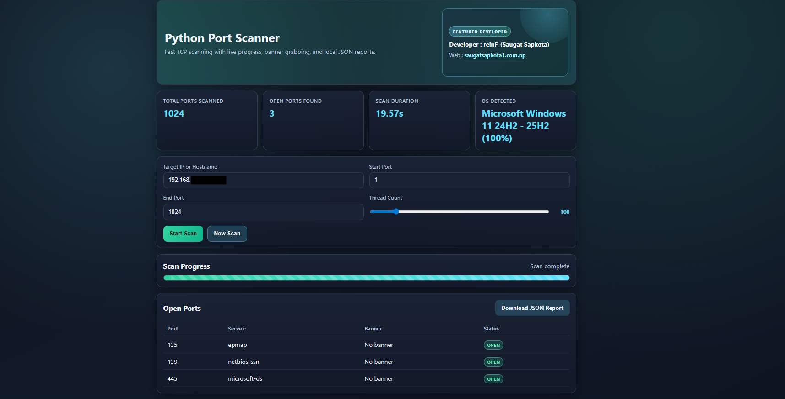

<p align="center">
  
  
</p>

# Python Port Scanner (Flask GUI)

A Windows-ready Python TCP port scanner with a Flask web interface, live scan progress, banner grabbing, optional Nmap OS fingerprinting, and downloadable JSON reports.

## 1) Prerequisites (Windows)

1. Install Python 3.10 or newer from https://www.python.org/downloads/windows/
2. Enable Add python.exe to PATH during installation.
3. Verify Python:
   - python --version

## 2) Install Nmap (for OS detection)

1. Download Nmap from https://nmap.org/download.html
2. Complete the Windows installer.
3. Add Nmap directory to PATH if required (commonly C:\Program Files (x86)\Nmap).
4. Verify installation:
   - nmap --version

If Nmap is unavailable, the scanner still runs and OS detection will report Nmap not available.

## 3) Install Python dependencies

From the folder containing app.py:

```powershell
pip install -r requirements.txt
```

## 4) Run the app

```powershell
python app.py
```

Then open:

- http://localhost:5000

Flask runtime configuration:

- host: 0.0.0.0
- port: 5000
- debug: False
- threaded: True

## 5) Using the scanner

1. Enter target IP or hostname.
2. Choose start/end ports and thread count.
3. Click Start Scan.
4. Track progress in real time.
5. Review open ports, service names, banners, and OS detection.
6. Download the generated JSON report.

Reports are written to the reports folder.

## Legal notice

Scanning external systems without explicit permission may be illegal. Use this tool only on systems you own or are authorized to test.
