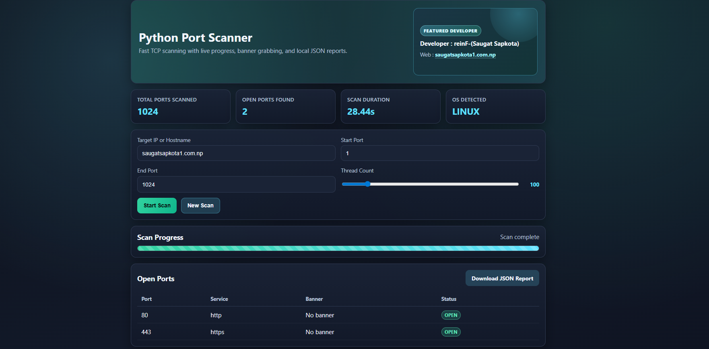
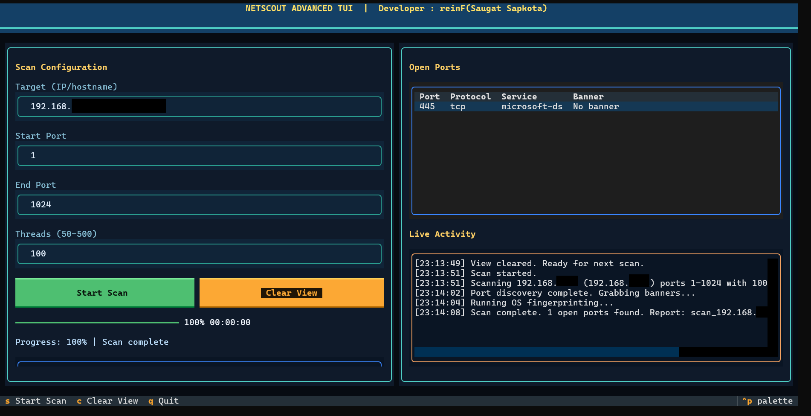

<p align="center">
   
   
   
</p>

# Python Port Scanner (Web + Advanced TUI)

Python TCP port scanner with:

- Flask web UI
- Advanced terminal UI (Textual TUI)
- Live progress updates
- Banner grabbing
- Nmap-based OS fingerprinting (optional)
- JSON report export

Developer : reinF(Saugat Sapkota)

## 1) Install dependencies

### Kali Linux (recommended for terminal usage)

```bash
sudo apt update
sudo apt install -y python3 python3-venv python3-pip nmap
```

### Windows

1. Install Python 3.10+ from https://www.python.org/downloads/windows/
2. Install Nmap from https://nmap.org/download.html
3. Ensure both Python and Nmap are available in PATH.

## 2) Create virtual environment and install Python packages

From the folder containing `app.py` and `tui.py`:

### Kali Linux

```bash
python3 -m venv .venv
source .venv/bin/activate
pip install -r requirements.txt
```

### Windows PowerShell

```powershell
python -m venv .venv
.\.venv\Scripts\Activate.ps1
pip install -r requirements.txt
```

## 3) Run the Advanced TUI (Terminal UI)

### Kali Linux

```bash
source .venv/bin/activate
python3 tui.py
```

If OS fingerprinting needs elevated privileges on your Kali setup, run:

```bash
sudo .venv/bin/python tui.py
```

### Windows

```powershell
.\.venv\Scripts\Activate.ps1
python tui.py
```

## 4) Run the Flask web interface

```bash
python app.py
```

Then open: `http://localhost:5000`

Flask runtime configuration:

- host: `0.0.0.0`
- port: `5000`
- debug: `False`
- threaded: `True`

## 5) Output reports

Generated scan reports are saved in the `reports/` folder as JSON files.

## Legal notice

Scan only systems you own or are explicitly authorized to test.
